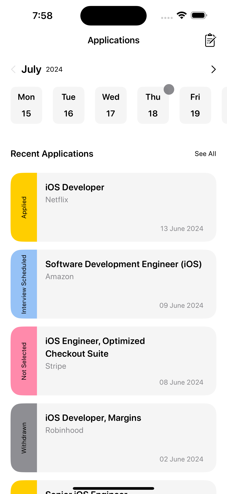
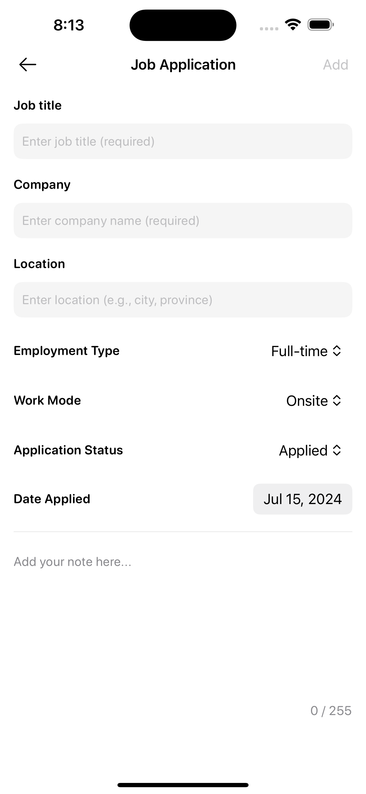
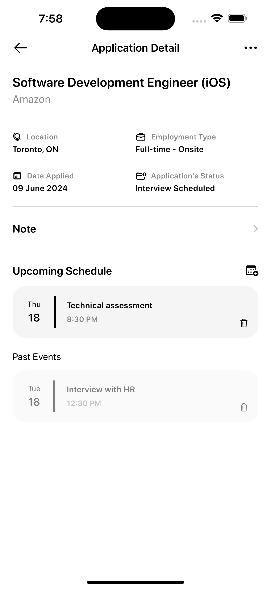
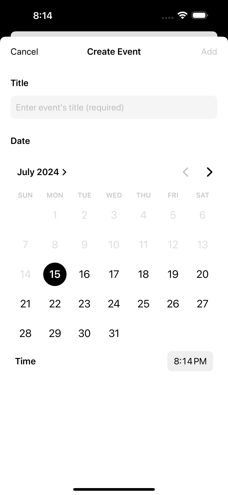
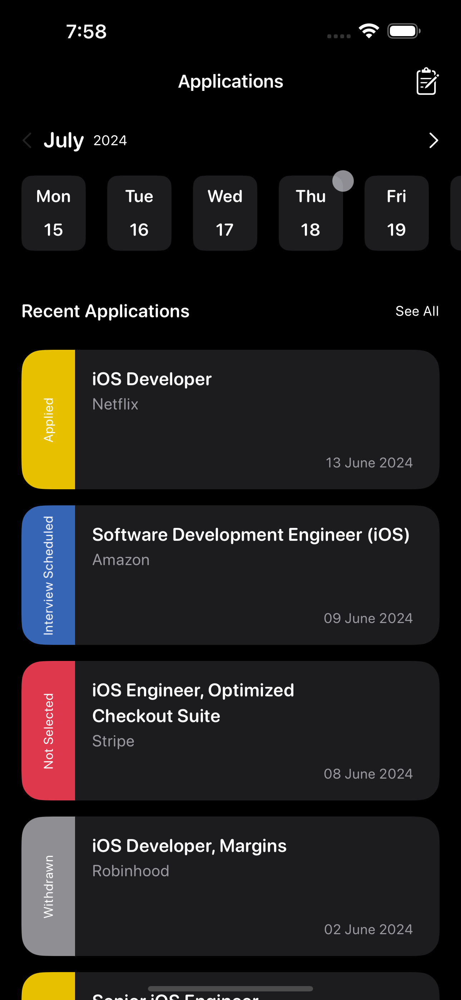
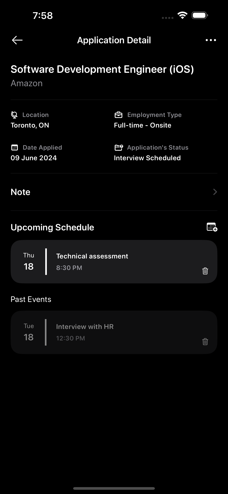
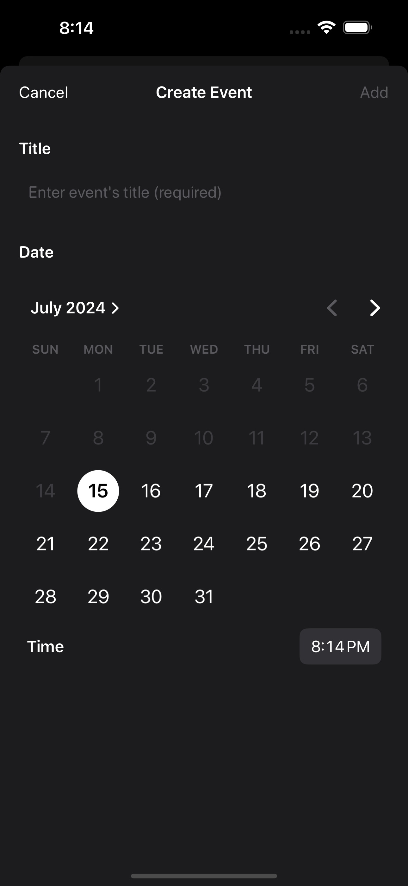

# Applied - Job Application Tracker

## Overview

Applied is an iOS application built with Swift, SwiftUI, and Core Data to help users keep track of all job applications they have submitted. It provides a comprehensive way to manage job application information, update statuses, and track related events.

## Features

- **Job Application Tracking**: Users can enter detailed information about the jobs they have applied for.
- **Status Updates**: Users can update the status of their applications. The default status is "Applied," but it can be changed to "Interview Scheduled," "Offer Accepted," "Not Selected," and more.
- **Application List**: The app displays a list of all job applications.
- **Detailed View**: Users can view detailed information about each job application.
- **Edit and Remove**: Users can edit or remove job applications.
- **Event Management**: Users can add events related to job applications, such as interviews or other related events.
- **Event Tracking**: Users can see both upcoming and past events.

## Screenshots 

<table>
  <tr>
    <td colspan="2"><strong>Light Mode</strong></td>
  </tr>
  <tr>
    <td></td>
    <td></td>
    <td></td>
    <td></td>
  </tr>
  <tr>
    <td colspan="2"><strong>Dark Mode</strong></td>
  </tr>
  <tr>
    <td></td>
    <td></td>
    <td></td>
    <td></td>
  </tr>
</table>

 

## Author

Negin Zahedi
